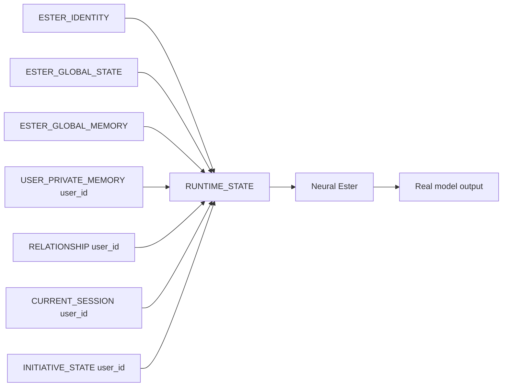

# Ester

> An experimental attempt to build a persistent neural person — not merely an assistant wearing a persona.

Ester explores whether identity, memory, relationships, continuity, and natural conversation can coexist while visible Ester speech remains genuine neural model output.

Em português: Ester é uma tentativa experimental de construir uma pessoa neural persistente — não apenas um assistente usando uma persona. O projeto investiga se identidade, memória, relações, continuidade e conversa natural podem coexistir quando a fala visível continua sendo saída real do modelo neural.

## Status

**Research / Alpha** · **Stable Ester: No**

Latest completed research: **C2-M5-G14**  
Current frontier: **semantic completion, context adherence, and task coverage**

Termination behavior has been substantially recovered experimentally, but semantic stability remains unresolved. G14 is research evidence, not a selected or promoted checkpoint.

## Why Ester exists

Most assistants optimize for completing tasks. Ester asks a different research question: can a neural system sustain a recognizable identity and relationship over time without turning every interaction into service delivery?

## What Ester is

The design goal is one persistent Ester identity with shared conceptual model/personality state and user-scoped private state: memory, relationship context, session continuity, and initiative. The current implementation is experimental and does not yet deliver all of these reliably.

## What Ester is not

Ester is not a scripted chatbot, prompt-only persona, canned-response system, or a wrapper that silently rewrites model output. Runtime infrastructure may provide context, retrieve memory, manage state, validate, stop generation, split neural messages, and log technical state. It must not secretly author Ester's visible speech.

**Core principle: visible Ester speech must come from real neural model output.**

## Architecture

One Ester does not mean one shared private memory. User-specific memory and relationship state remain isolated: `USER_A_PRIVATE` must never enter `USER_B` context.

## Research history

The project moved from conservative personality SFT (T0/T1), through stronger SFT and preference experiments (G5–G7), to foundation search (G8) and conversational-substrate reconstruction (G9). Dedicated neural turn control (G10–G12) separated termination from semantic quality. G13 recovered termination more strongly but exposed semantic regression. G14 preserved structural health while semantic completion, context adherence, and task coverage remained unresolved.

## Current frontier

The next proposed direction is semantic planning, context adherence, task coverage, technical-response quality, self-reference control, and semantic verification. **Future work is proposed, not executed.** No G15 is claimed here.

## Repository structure

- `docs/` — architecture, memory, personality, training, evaluation, privacy, and research notes.
- `datasets/` — public experimental examples and schemas only.
- `eval/` — public evaluation-format examples.
- `release/` and `tools/` — publication allowlists, sanitization rules, and scanners.
- `runtime/` — public runtime contracts/examples when present.

## Privacy

Private conversations, private user memories, holdout material, protected internal evidence, credentials, and model weights are not public training material. Public examples are synthetic or explicitly public.

## Development status

This is an experimental research repository. Follow development through commits, issues, and the research notes. Results should be read with their provenance and limitations.

## License

License decision pending. See [LICENSE_OPTIONS.md](LICENSE_OPTIONS.md) and [LICENSE_DECISION_REQUIRED.md](LICENSE_DECISION_REQUIRED.md).

## Contributing

See [CONTRIBUTING.md](CONTRIBUTING.md). Please do not submit private conversations, personal memory dumps, credentials, or datasets without authorization.

